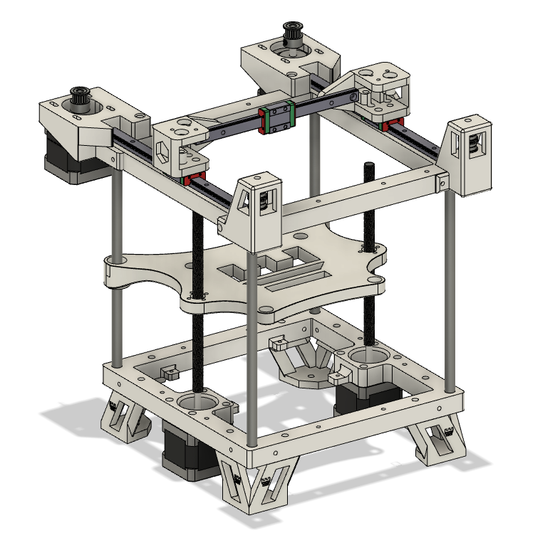

# Rook

My mod of the Rook printer.

After building original Rook i need to reprint some parts due to their bad dimensional accuracy caused by some issues with my other printer that i used for printing Rook.

In this mod i'm adding some features i missed in the original rook and i'm making it easier to build.

### Major changes:

* it's possible to use bolts with nuts instead of threaded heat inserts

* there are some extra holes in the frame for unpredicted additions, cable management, etc

* mounts for motors A and B have the same height of the element that colides with the carriage for better sensorless homing of Y axis

* idler towers 

* 2 more mounting poins for board plate at the bottom frame for easier attachment of bigger mounts

* hole spacings are more rounded to make adding new modifications easier (no more distances with 3 random decimal points)

### The original Rook can be found [here](https://github.com/rolohaun/Rook)
